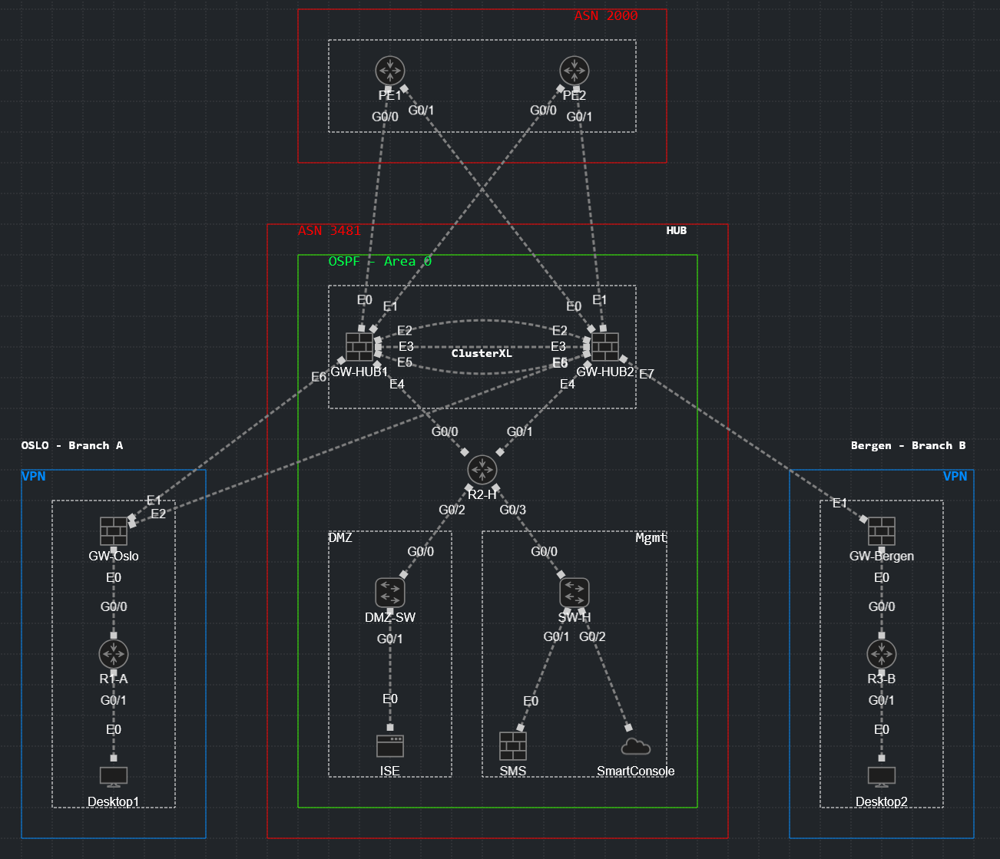

# Project 6 - Check Point R82 Enterprise Security Architecture

This repository features a multi-ASN and multi-site VPN topology built in CML 2.9.0, focusing on Check Point **R82.00** and **R81.20**. Demonstrating ClusterXL HA, centralized management with SMS and SmartConsole, Zero Trust segmentation, and roting with OSPF and BGP. 

---

## About this lab

This lab simulates a multi-site enterprise security infrastructure, using Check Point R82 and R82.10 Quantum Security Gateways:

- **ClusterXL High Availability** - Active/Standby clustering with state synchronization
- **Centralized Management** - Security Management Server (SMS) with SmartConsole administration
- **VPN Communities** - Star topology hub-and-spoke site-to-site VPN
- **Multi-Layer Security Policy** - Threat Prevention + Access Control with policy layers
- **Zero Trust Architecture** - Least privilege, micro-segmentation
- **Advanced Threat Prevention** - IPS blade with exploit testing, basic URL Filtering
- **Dynamic Routing Integration** - OSPF for internal routing, BGP for external peering
- **Enterprise Logging Strategy** - Log, Detailed Log, Extended Log for different use cases with documented reasoning

---

## Network Topology



---

## Network Device images

| Device           | Image version         |
| ---------------- | --------------------- | 
| SMS              | GAiA R82              |
| Security Gateway | GAiA R82, GAiA R81.20 |
| vIOS             | 15.9(3) M10           | 
| Desktop          | Alpine Linux 3.21.3   | 
| Tacacs Plus      | F4.0.4.28             |

## Lab Requirements

| Component  | Requirement                 | Notes                                              |
|------------|-----------------------------|----------------------------------------------------|
| RAM        | 41GB (with KSM)             | SMS: 12GB, Gateways: 8GB each, Routers: 1GB each   |
| vCPU       | 37+ vCPUs                   | 6 per gateway, 8 for SMS, 1 per router             |
| Platform   | CML 2.9.0                   | Check Point R82 & R81.20 Gaia, Tacacs+, vIOS 15.9  |
| License    | 15-day eval (full features) | After 15 days: limited but usable for lab          |

Refer to [notes.md](/notes.md) to tune and enable KSM on CML. It would take up to 15 minutes for a full memory de-duplication.

---

## File Structure

```
├── configs/                        # Device-specific startup configs
├── docs/                           # Network design documentation
│   ├── IPv4_Plan.md
│   ├── ASN_Plan.md
│   ├── Logging_Strategy.md         # Log vs Detailed vs Extended
│   └── ClusterXL_Design.md
├── steps/                          # Step-by-step implementation guides
│   ├── 01_SMS_Setup.md
│   ├── 02_Gateway_Deployment.md
│   ├── 03_ClusterXL_Configuration.md
│   ├── 04_Routing_OSPF_BGP.md
│   ├── 05_VPN_Communities.md
│   ├── 06_Security_Policy.md
│   ├── 07_Threat_Prevention.md
│   └── 08_Testing_Validation.md
├── topology/                       # Network diagram
├── smartconsole/                   # Exported policy packages
├── logs/                           # Sample log exports
├── images/                         # Screenshots from implementation
└── notes.md                        # Lab journal, troubleshooting
```

---

## Notes

This lab builds on previoux experience from **Project 5** (Fortinet Multi-ASN), where I hit an evaluation license which limits at 3 firewall policies on the hub. Project 6 demonstrates a full Check Point capabilities without restriction due to R82's 15-day evaluation license.

The focus of the lab is on **entperise security best practices** using Check Point - logging strategy, policy organization, and Zero Trust. The routing complexity (OSPF + BGP) is intentional to widen my knowledge in dynamic routing protocls integrated with Check Point.

---

## References

- [Check Point R82 - Quantum Security Gateway](https://sc1.checkpoint.com/documents/R82/WebAdminGuides/EN/CP_R82_SecurityGateway_Guide/CP_R82_Quantum_SecurityGateway_AdminGuide.pdf)
- [Check Point R81.20 - Quantum Security Gateway](https://sc1.checkpoint.com/documents/R81.20/WebAdminGuides/EN/CP_R81.20_SecurityGateway_Guide/CP_R81.20_Quantum_SecurityGateway_AdminGuide.pdf)
- [ClusterXL Documentation](https://sc1.checkpoint.com/documents/R82/WebAdminGuides/EN/CP_R82_ClusterXL_AdminGuide/CP_R82_ClusterXL_AdminGuide.pdf)